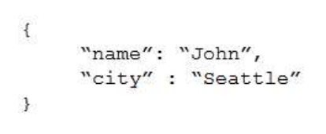
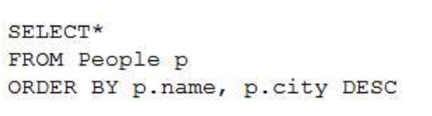
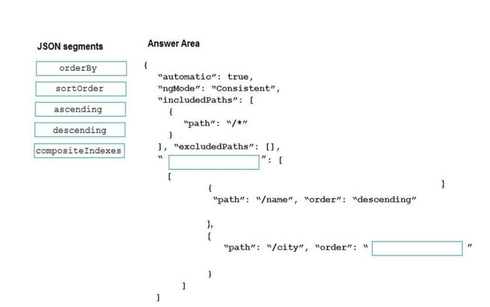
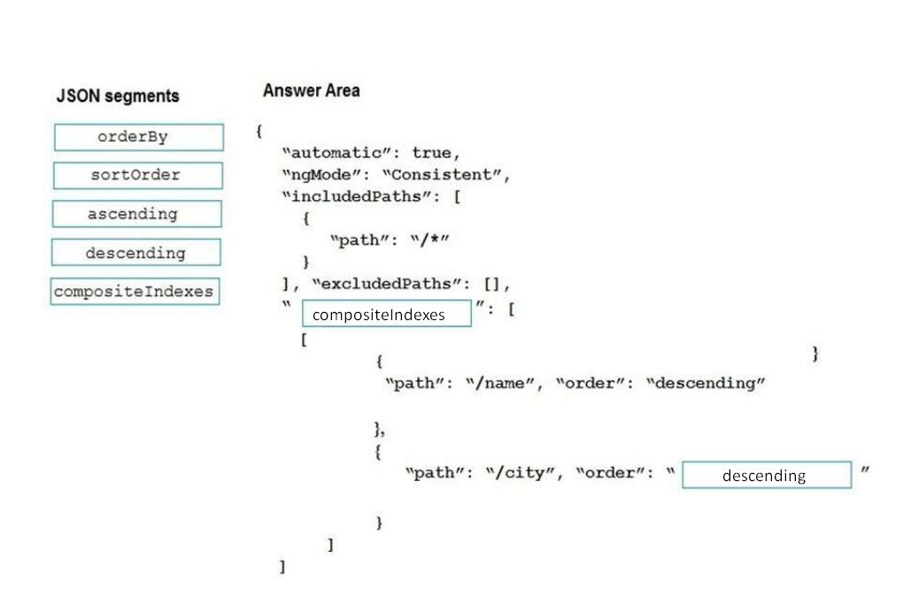
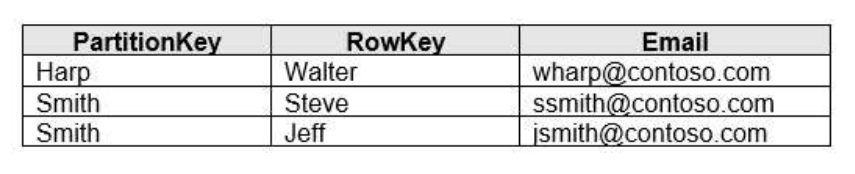
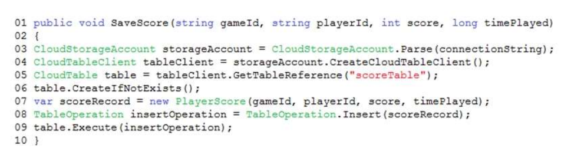
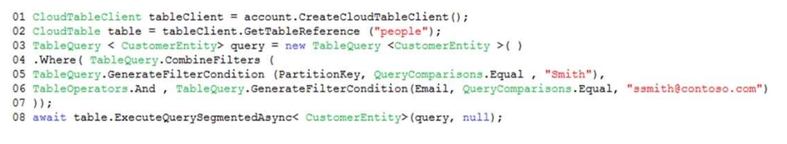
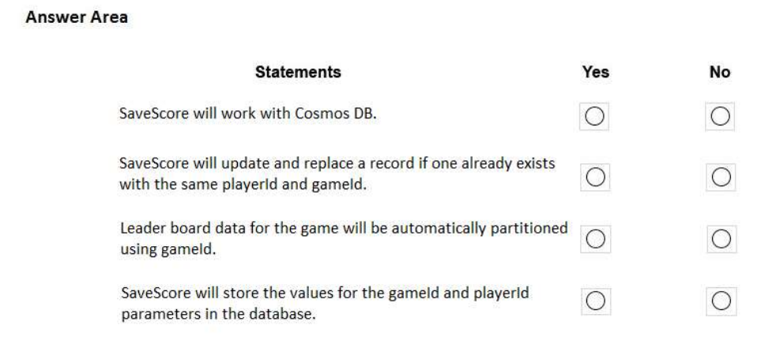
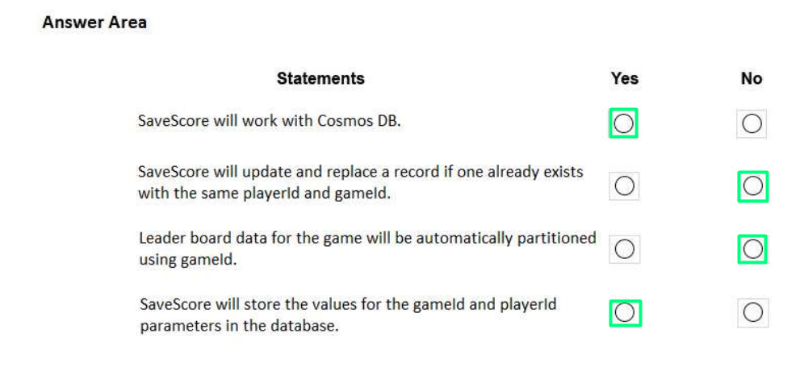

# Tema 1: Develop solutions that use Cosmos DB storage

- ### ¿Qué es Azure Cosmos DB y qué ventajas ofrece como servicio de base de datos?

Azure Cosmos DB es un servicio de bases de datos NoSQL totalmente administrada diseñada para proporcionar una latencia baja, una escalabilidad elástica del rendimiento, una semántica bien definida para la coherencia de los datos y una alta disponibilidad.

Las ventajas de Azure Cosmos DB son las siguientes:

1. Distribución global: Ofrece una distribución global automática de datos en múltiples regiones de Azure, lo que permite a las aplicaciones ofrecer baja latencia y alta disponibilidad a nivel mundial. Los datos se replican de forma transparente y se sincronizan automáticamente en todas las regiones.
2. Modelos de datos flexibles: Admite diferentes tipos de datos, como documentos, gráficos, clave-valor, columnas amplias y tablas.
3. Escalabilidad elástica: Permite el escalado vertical y horizontalmente los recursos de almacenamiento y rendimiento de forma independiente. Esto significa que se puede aumentar o disminuir la capacidad de almacenamiento y el rendimiento de forma dinámica para adaptarse a las necesidades cambiantes de la aplicación, sin tiempo de inactividad o interrupciones.
4. Rendimiento garantizado: Ofrece acuerdos de nivel de servicio (SLA) para latencia baja y alta disponibilidad, respaldados por una arquitectura distribuida y réplicas automáticas de datos. Esto asegura que las aplicaciones tengan un rendimiento predecible y confiable, incluso en escenarios de alta carga de trabajo.
5. Consistencia global: Proporciona opciones de consistencia flexibles que permiten equilibrar entre la fuerte coherencia y la baja latencia de lectura, adaptándolo según las demandas de la aplicación.
6. Integración con servicios de Azure: Se integra estrechamente con otros servicios de Azure, como Azure Functions, Azure Search, Azure Stream Analytics y Azure Machine Learning. Esto facilita la construcción de aplicaciones completas y escalables que aprovechan múltiples servicios de Azure.

- ### ¿Cuáles son los modelos de datos compatibles con Azure Cosmos DB?

A continuación, se detalla el punto dos de las ventajas de Azure Cosmos DB:

1. Documentos: Permite almacenar y consultar documentos JSON o BSON. Los documentos son esencialmente estructuras de datos flexibles y jerárquicas que se pueden indexar y consultar eficientemente.
2. Gráficos: Admite el modelo de datos de grafo, lo que repercute en el almacenamiento de datos en forma de nodos y relaciones. Esto es útil para aplicaciones que requieren análisis de redes sociales, recomendaciones personalizadas y algoritmos de rutas más corta.
3. Clave-Valor: Acepta el modelo de datos clave-valor, que es adecuado cuando se requiere una alta velocidad de acceso a través de una clave única. Se pueden almacenar y recuperar datos utilizando una clave única asociada a cada elemento.
4. Columnas Amplias (Wide columns): Acoge modelos de columnas anchas, siendo estos ideales para casos de uso analíticos y consultas en columnas específicas en lugar de filas completas.
5. Tablas: Admite el modelo de datos de tablas, que proporciona una estructura simple de filas y columnas. Es útil para aplicaciones que requieren un esquema fijo y una alta velocidad de escritura y lectura.

- ### ¿Cómo se accede y se realiza consultas a una base de datos de Cosmos DB en Azure?

Para acceder y realizar consultas a una base de datos de Azure Cosmos DB, hay varias formas que se enumeran a continuación:

1. Portal de Azure: Se puede acceder a la base de datos de Cosmos DB a través del portal de Azure. Desde el portal se pueden administrar y consultar los datos utilizando la interfaz de usuario proporcionada.
2. Azure Cosmos DB SDK (Software Development Kits): Microsoft ofrece SDKs para varios lenguajes de programación, tales como .NET, Java, Python, Node.js, etc. Se puede recurrir a alguno de estos lenguajes para realizar una conexión a la base de datos de Cosmos DB y realizar operaciones CRUD (crear, leer, actualizar y eliminar) o consultas mediante código.
3. API REST: A través de la API REST se pueden realizar solicitudes HTTP directamente a la base de datos. Empleándose bibliotecas HTTP o realizando solicitudes directas mediante herramientas como Postman.
4. Lenguaje de consulta: Para realizar consultas en Azure Cosmos DB, se puede recurrir al lenguaje de consulta SQL API. Este lenguaje es compatible con consultas SELECT, JOIN, GROUP BY, filtros, etc., permitiendo consultar datos de manera eficiente.
5. Consultas LINQ (Language Integrated Query): Si se utiliza el SDK de .NET para interactuar con Azure Cosmos DB, es posible aprovechar LINQ, que es un conjunto de extensiones del lenguaje que permite realizar consultas en las bases de datos utilizando una sintaxis similar a SQL pero integrada en el código.

Independientemente de la opción que se emplea, es necesario proporcionar las credenciales y la cadena de conexión adecuadas para autenticarse en la base de datos de Cosmos DB y acceder a ella.

- ### Question 1, pág 81

*You develop Azure solutions.*

*You must connect to a No-SQL globally-distributed database by using the .NET API.* 

*You need to create an object to configure and execute requests in the database.*

*Which code segment should you use?* 

*A.* ``new Container(EndpointUri, PrimaryKey);``

*B.* ``new Database(EndpointUri, PrimaryKey);``

*C.* ``new CosmosClient(EndpointUri, PrimaryKey);``

C. pues para realizar una conexión con una base de datos distribuida globalmente de tipo No-SQL en Azure Cosmos DB utilizando la API .NET, se debe recurrir a ``new CosmosClient(EndpointUri, PrimaryKey)``. La clase ``CosmosClient`` permite interacturar con Cosmos DB empleando el SDK .NET. Por lo que representa una conexión del cliente a su cuenta de Cosmos DB. De forma que, se debe proporcionar el ``EndpointUri`` y el ``PrimaryKey`` como parámetros para crear una instancia de ``CosmosClient``. Además, el ``EndpointUri`` es el URI del punto de conexión a la cuenta de Cosmos DB, y el ``PrimaryKey`` es la clave de autenticación para acceder a dicha cuenta.

- ### Question 2, pág 81

*DRAG DROP*

*You are developing a new page for a website that uses Azure Cosmos DB for data storage. The feature uses documents that have the following format:*

*You must display data for the new page in a specific order. You create the following query for the page:*

*You need to configure a Cosmos DB policy to support the query.*

*How should you configure the policy? To answer, drag the appropriate JSON segments to the correct locations. Each JSON segment may be used once, more than once, or not at all. You may need to drag the split bar between panes or scroll to view content.*

*NOTE: Each correct selection is worth one point.*

*Select and Place:*

Para realizar una consulta que ordena con más de una opción se requiere de ``compositeIndexes``. Además, en la query se indica que city se ordena de forma descendente, recurriéndose a ``descending``. Quedando la solución como se muestra a continuación:

- ### Question 8, pág 90

*HOTSPOT* 

*A company develops a series of mobile games. All games use a single leaderboard service.*

*You have the following requirements:*

- *Code must be scalable and allow for growth.*
- *Each record must consist of a* ``playerId``*,* ``gameId``*,* ``score``*,* *and* ``timePlayed``*.*
- *When users reach a new high score, the system will save the new score using the* ``SaveScore`` *function below.*
- *Each game is assigned an Id based on the series title.*

*You plan to store customer information in Azure Cosmos DB. The following data already exists in the database:*

*You develop the following code to save scores in the data store. (Line numbers are included for reference only.)*

*You develop the following code to query the database. (Line numbers are included for reference only.)*

*For each of the following statements, select Yes if the statement is true. Otherwise, select No.*

*NOTE: Each correct selection is worth one point.*

*Hot Area:*

1. Yes, porque se crea una tabla de la siguiente forma:

   Un objeto ``CloudTableClient`` permite obtener referencias a objetos de tablas y entidades. El siguiente código crea un objeto ``CloudTableClient`` y lo utiliza para crear un nuevo objeto ``CloudTable``, que representa una tabla.

   // Se obtiene la cuenta de almacenamiento a partir de la cadena de conexión. 

   ``CloudStorageAccount storageAccount = CloudStorageAccount.parse(storageConnectionString);``

   // Se crea el cliente de la tabla. 

   ``CloudTableClient tableClient = storageAccount.createCloudTableClient();``

   // Se crea la tabla si no existe. 

   ``String tableName = "people";`` 

   ``CloudTable cloudTable = tableClient.getTableReference(tableName);`` 

   ``cloudTable.createIfNotExists();``

2. No, se insertan nuevos registros con ``TableOperation.insert`` y los registros antiguos no se actualizan. Para actualizar dichos registros se debería emplear ``TableOperation.insertOrReplace``. 

3. No, dado que no se especifica ninguna clave de partición para ``scoreTable``.
4. Yes, esto se muestra en la clase ``SaveScore``, que entre los comando que recibe se encuentran ``gameId`` y ``playerId``.

En consecuencia, el resultado viene dado por la siguiente imagen:

