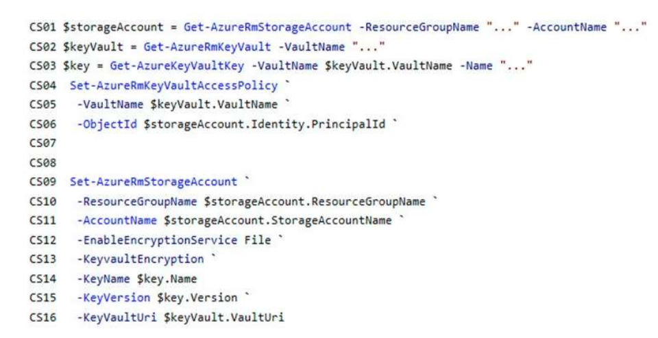
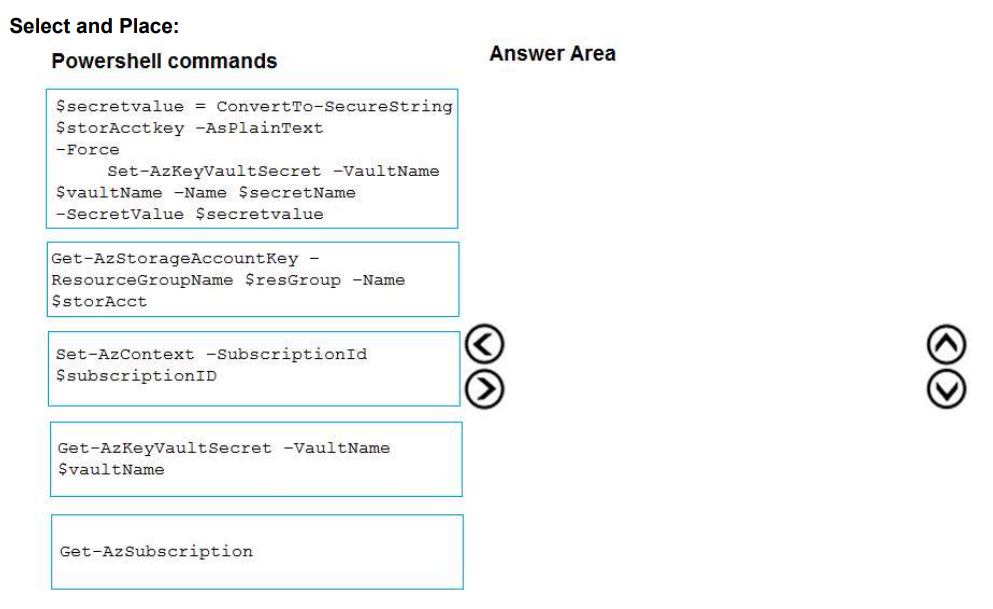
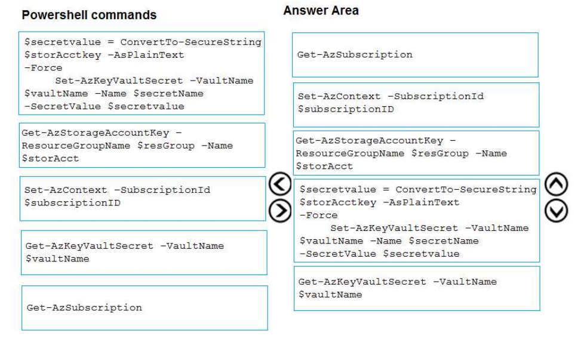
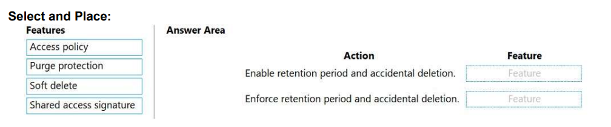
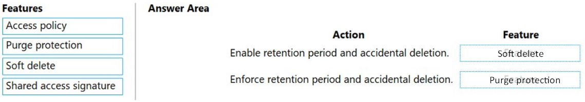

# Tema 2: Implement secure Azure solutions

- ### ¿Qué es Azure Key Vault y cómo se utiliza para proteger secretos y claves criptográficas?

Azure Key Vault es un servicio de administración de secretos y claves criptográficas ofrecido por Microsoft Azure. Proporciona un entorno seguro para almacenar y gestionar secretos, tales como contraseñas, claves de API, certificados y claves criptográficas.

Azure Key Vault se utiliza para proteger secretos y claves criptográficas del siguiente modo:

1. Almacenamiento seguro: Proporciona un almacén seguro para los secretos y las claves criptográficas. Los datos se almacenan de forma cifrada en la infraestructura de Azure y se aplican medidas de seguridad adicionales, como control de acceso basado en roles y auditoría.
2. Gestión centralizada: Se pueden crear y almacenar secretos y claves criptográficas de forma centralizada. Esto evita la dispersión de secretos en diferentes aplicaciones y facilita la gestión y actualización de los mismos.
3. Acceso controlado: Permite controlar y restringir el acceso a los secretos y claves. Se posibilita la configuración de las políticas de acceso para definir quién puede leer, escribir o administrar los secretos. Además, el acceso a Key Vault se puede integrar con Azure Active Directory (Azure AD) para una autenticación y autorización basada en identidades.
4. Ciclo de vida de secretos: Proporciona capacidades para el ciclo de vida de los secretos. Se permite configurar políticas de expiración y rotación automática de secretos, lo que mejora la seguridad y evita el uso prolongado de secretos obsoletos.
5. Integración con aplicaciones: Ofrece APIs y SDKs para integrarse fácilmente con aplicaciones. De modo que, se puede acceder y utilizar los secretos y claves almacenados en Key Vault desde las aplicaciones y los servicios de Azure de forma segura, sin tener que almacenarlos directamente en el código o configuraciones.

- ### ¿Cuál es el papel de las Identidades Administradas (Managed Identities) en la seguridad de Azure?

Las Identidades Administradas (Managed Identities) desempeñan un papel importante en la seguridad de Azure al proporcionar una forma segura y conveniente de autenticarse y autorizarse en los servicios de Azure.

A continuación, se muestran algunos aspectos importantes sobre el papel de las Identidades Administradas en la seguridad de Azure:

1. Autenticación segura: Permiten que las aplicaciones y los servicios de Azure puedan autenticarse en otros servicios de Azure sin necesidad de administrar y proteger explícitamente las credenciales, como nombres de usuario y contraseñas, claves de API u otros secretos. En su lugar, Azure se encarga de generar y administrar automáticamente las credenciales asociadas con la identidad administrada.
2. Eliminación de credenciales en el código: Se puede evitar almacenar credenciales sensibles en el código fuente de tus aplicaciones y servicios. Esto reduce los riesgos de seguridad asociados con la exposición accidental o maliciosa de las credenciales.
3. Integración con roles de Azure: Están estrechamente integradas con el sistema de roles y permisos de Azure. Se pueden asignar roles específicos a las identidades administradas para autorizar el acceso a recursos y servicios de Azure. Esto permite una administración de acceso granular y basada en roles, lo que mejora la seguridad y la gobernanza.
4. Gestión centralizada de identidades: Azure ofrece la posibilidad de crear y administrar identidades administradas en el nivel de recursos. Esto significa que es posible asignar una identidad administrada a un recurso específico, como una máquina virtual o una función de Azure, y luego utilizar esa identidad para acceder a otros servicios de Azure. Así, se simplifica la gestión y la configuración de las identidades y se asegura que únicamente los recursos autorizados tengan acceso a otros servicios.
5. Escalabilidad y flexibilidad: Están diseñadas para ser escalables y flexibles, lo que las hace adecuadas para implementaciones en la nube de cualquier tamaño. Pudiendo usarse tanto en entornos de desarrollo como en producción.

- ### ¿Cómo se configuran y se utilizan Azure Key Vault y las Identidades Administradas?

La configuración y el uso de Azure Key Vault y las Identidades Administradas implican los siguientes pasos:

1. Configuración de Azure Key Vault:
   - Se crea un recurso de Azure Key Vault en el portal de Azure.
   - Se configuran las políticas de acceso y los permisos para definir quién puede administrar y acceder a los secretos y claves almacenados en Key Vault.
   - Opcionalmente, se configuran las características adicionales, como el registro de auditoría y las políticas de retención.
2. Configuración de la Identidad Administrada:
   - Se crea una Identidad Administrada asociada al recurso (por ejemplo, una máquina virtual o una función de Azure) para la que se desea utilizar la autenticación y autorización sin credenciales explícitas.
   - Se asigna roles y permisos a la Identidad Administrada para controlar el acceso a los recursos y servicios de Azure.
3. Asignación de permisos a la Identidad Administrada en Azure Key Vault:
   - Se asigna un rol o permisos de acceso específicos a la Identidad Administrada en Azure Key Vault para que pueda leer o escribir secretos y claves criptográficas.
4. Uso de Azure Key Vault y la Identidad Administrada en la aplicación o servicio:
   - Dentro de la aplicación o el servicio, se utiliza el SDK de Azure Key Vault para interactuar con los secretos y claves almacenados en Key Vault.
   - Se configura la aplicación o el servicio para utilizar la Identidad Administrada al acceder a Azure Key Vault en lugar de usar credenciales explícitas.
   - Se utilizan métodos y funciones proporcionados por el SDK de Azure para obtener, crear o actualizar secretos y claves criptográficas en Azure Key Vault.

Cuando la Identidad Administrada se encuentre correctamente configurada y los permisos se hayan asignado adecuadamente en Azure Key Vault, la aplicación o servicio podrá autenticarse y acceder a los secretos y claves criptográficas en Azure Key Vault sin necesidad de gestionar credenciales explícitas.

- ### Question 2, pág 140

*You need to ensure the security policies are met.*

ConfigureSSE.ps1

*What code do you add at line CS07 of ConfigureSSE.ps1?*

*A. –*``PermissionsToKeys create, encrypt, decrypt`` 

*B. –*``PermissionsToCertificates create, encrypt, decrypt``

*C. –*``PermissionsToCertificates wrapkey, unwrapkey, get``

*D. –*``PermissionsToKeys wrapkey, unwrapkey, get``

D. Porque todos los certificados y secretos utilizados para asegurar los datos deben almacenarse en Azure Key Vault. Para ello es necesario recuperar las claves, por lo que se requiere el permiso ``get``. Las operaciones ``wrapkey`` y ``unwrapkey`` se utilizan para el cifrado simétrico y la recuperación de metadatos de clave, mediante el descifrado.

- ### Question 1, pág 142

*DRAG DROP*

*You are developing an application. You have an Azure user account that has access to two subscriptions.*

*You need to retrieve a storage account key secret from Azure Key Vault.*

*In which order should you arrange the PowerShell commands to develop the solution? To answer, move all commands from the list of commands to the answer area and arrange them in the correct order.*

1.  ``Get-AzSubscription``: Si se tienen varias suscripciones, es posible que se deba especificar aquella que se utilizó para crear el almacén de claves y este comando se ejecuta para ver las suscripciones de la cuenta.

2. ``Set-AzContext -SubscriptionId $subscriptionID``: Esto es necesario para especificar la suscripción asociada al almacén de claves en el que se iniciará la sesión.

3. ``Get-AzStorageAccountKey - ResourceGroupName $resGroup -Name $storAcct``:Esto se necesita obtener la clave de la cuenta de almacenamiento.

4. ``$secretvalue = ConvertTo-SecureString $storageAccountKey -AsPlainText -Force Set-AzKeyVaultSecret -VaultName $vaultName -Name $secretName -SecretValue $secretvalue``: Después de recuperar el secreto (en este caso, la clave de la cuenta de almacenamiento), se convierte esa clave en un objeto ``SecureString`` y luego se crea un secreto con ese valor en el almacén de claves.
5. ``Get-AzKeyVaultSecret -VaultName $vaultName``: Se debe obtener la URI del secreto creado, para poder llamar al almacen de claves y recuperar el secreto, Se ejecuta este comando y se anota el valor del ID, que es la URI del secreto. 

- ### Question 17, pág 156

*DRAG DROP*

*You are developing an application to securely transfer data between on-premises file systems and Azure Blob storage. The application stores keys, secrets, and certificates in Azure Key Vault. The application uses the Azure Key Vault APIs.*

*The application must allow recovery of an accidental deletion of the key vault or key vault objects. Key vault objects must be retained for 90 days after deletion.*

*You need to protect the key vault and key vault objects.*

*Which Azure Key Vault feature should you use? To answer, drag the appropriate features to the correct actions. Each feature may be used once, more than once, or not at all. You may need to drag the split bar between panes or scroll to view content.*

*NOTE: Each correct selection is worth one point.*

1. Eliminación suave (Soft delete): Cuando se habilita esta característica, los recursos marcados como eliminados se conservan durante un período especificado (por defecto, 90 días). El servicio proporciona además un mecanismo para recuperar el objeto eliminado, deshaciendo efectivamente la eliminación.
2. Protección de purga (Purge protection): La protección de purga es un comportamiento opcional de Key Vault y no se encuentra habilitada por defecto. Es importante destacar, que sólo se puede utilizar tras haber habilitado la eliminación suave.

Al estar activada Purge protection, un almacén o un objeto en estado eliminado no se puede purgar hasta que haya transcurrido el período de retención. Los almacenes y objetos eliminados con Soft delete aún se pueden recuperar, asegurándose el cumplimiento de la política de retención. Mostrándose la solución en la siguiente imagen:

